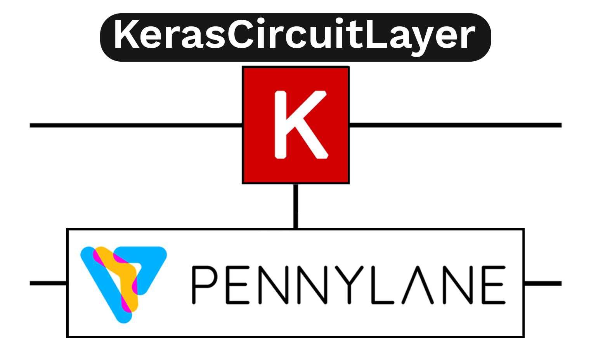

# PennyLane Keras Layer

A library to introduce Keras 3 support to PennyLane with full support for multi-backend training.

[](https://pypi.org/project/pennylane-keras3-layer/)

## Overview

This package provides integration between PennyLane (a quantum computing framework) and Keras 3, enabling the use of quantum layers in neural networks with support for multiple backends.

### Key Features

- **Multi-Backend Support**: Works seamlessly with JAX, TensorFlow, and PyTorch
- **Easy Integration**: Drop-in replacement for standard Keras layers  
- **High Performance**: JIT compilation support with JAX backend
- **Serialization**: Full support for model saving and loading
- **Flexible Configuration**: Customizable quantum circuit parameters
- **Keras-Native Experience**: Use standard `model.fit()`, `model.save()`, and high-level APIs.
- **Unified API**: One layer for all your deep learning research needs.

## Installation

### From source

```bash
git clone https://github.com/vinayak19th/pennylane-keras-layer.git
cd pennylane-keras-layer
pip install -e .
```

### Development installation

For development, install with additional dependencies:

```bash
pip install -e ".[dev]"
```

## Requirements

- Python >= 3.8
- PennyLane >= 0.30.0
- Keras >= 3.0.0
- NumPy >= 1.21.0

## Hardware 
Works on all devices supported by PennyLane, JAX or PyTorch provided the backend is correctly setup. This includes:
- All CPUs (Including Apple Silicon)
- Nvidia GPUs (CUDA)
- AMD GPUs
- Intel ARC 

> Note: Apple Silicon support is limited to CPU backend due to missing support for float64 and complex32 dtype in jax-metal and pytorch-mps.

## Quick Start

### Option 1: Data Re-Uploading Circuit Layer

```python
import os
os.environ["KERAS_BACKEND"] = "jax"  # Set backend before importing keras

import numpy as np
import keras
from pennylane_keras_layer import KerasDRCircuitLayer

# Create sample data
X_train = np.linspace(-np.pi, np.pi, 100).reshape(-1, 1)
y_train = np.sin(X_train)

# Create a Data Re-Uploading quantum layer
q_layer = KerasDRCircuitLayer(layers=3, scaling=1.0, num_wires=1)

# Build a model
model = keras.Sequential([
    keras.layers.Input(shape=(1,)),
    q_layer
])

# Compile and train
model.compile(optimizer="adam", loss="mse")
model.fit(X_train, y_train, epochs=50)
```

### Option 2: Generic Circuit Layer with Custom QNode

```python
import pennylane as qml
from pennylane_keras_layer import KerasCircuitLayer

# Define a custom quantum circuit
dev = qml.device('default.qubit', wires=2)

@qml.qnode(dev)
def custom_circuit(weights, inputs):
    qml.RX(inputs[0], wires=0)
    qml.Rot(*weights[0], wires=0)
    qml.CNOT(wires=[0, 1])
    qml.Rot(*weights[1], wires=1)
    return qml.expval(qml.PauliZ(0))

# Create a generic quantum layer
weight_shapes = {"weights": (2, 3)}
q_layer = KerasCircuitLayer(custom_circuit, weight_shapes, output_dim=1)

# Use in a Keras model
model = keras.Sequential([
    keras.layers.Input(shape=(1,)),
    q_layer
])
```

## Documentation

Comprehensive documentation is available in the [`docs/`](docs/) directory:

- **[Getting Started](https://github.com/vinayak19th/pennylane-keras-layer/blob/main/docs/getting_started.md)**: Installation and setup guide
- **[User Guide](https://github.com/vinayak19th/pennylane-keras-layer/blob/main/docs/user_guide.md)**: In-depth concepts and best practices
- **[API Reference](https://github.com/vinayak19th/pennylane-keras-layer/blob/main/docs/api_reference.md)**: Detailed API documentation
- **[Tutorials](https://github.com/vinayak19th/pennylane-keras-layer/blob/main/docs/tutorials.md)**: Step-by-step tutorials for different backends
- **[Examples](https://github.com/vinayak19th/pennylane-keras-layer/blob/main/docs/examples.md)**: Complete working examples
- **[FAQ](https://github.com/vinayak19th/pennylane-keras-layer/blob/main/docs/faq.md)**: Frequently asked questions
- **[Contributing](https://github.com/vinayak19th/pennylane-keras-layer/blob/main/docs/contributing.md)**: How to contribute to the project


## Examples

Check out the `examples/` directory for usage examples:

```bash
# Run basic example
python examples/basic_example.py

# Run Fourier series approximation demo
python examples/fourier_series_example.py
```

## Development

### Running tests

The package includes a comprehensive test suite in the `tests/` directory:

```bash
# Run all tests
pytest tests/

# Run with coverage
pytest tests/ --cov=pennylane_keras_layer --cov-report=term-missing

# Run specific test file
pytest tests/test_layer.py -v

# Run only integration tests
pytest tests/ -m integration

# Run tests with specific backend
pytest tests/ --backend=tensorflow  # or torch, or jax
```

**Testing with different backends:**
- TensorFlow: `pytest tests/ --backend=tensorflow` (requires `pip install tensorflow`)
- PyTorch: `pytest tests/ --backend=torch` (requires `pip install torch`)
- JAX: `pytest tests/ --backend=jax` (requires `pip install jax jaxlib`)

See [tests/README.md](https://github.com/vinayak19th/pennylane-keras-layer/blob/main/tests/README.md) for detailed information about the test suite.

### Code formatting

```bash
black pennylane_keras_layer/ tests/
```

### Linting

```bash
flake8 pennylane_keras_layer/ tests/
```

## Contributing

Contributions are welcome! Please see our [Contributing Guide](https://github.com/vinayak19th/pennylane-keras-layer/blob/main/docs/contributing.md) for:

- How to report bugs
- How to suggest features
- Development setup
- Code standards
- Pull request process

Feel free to submit a Pull Request or open an issue!

## License

This project is licensed under the MIT License - see the [LICENSE](LICENSE) file for details.

## Acknowledgments

- [PennyLane](https://pennylane.ai/) - Quantum machine learning framework
- [Keras](https://keras.io/) - Deep learning API
